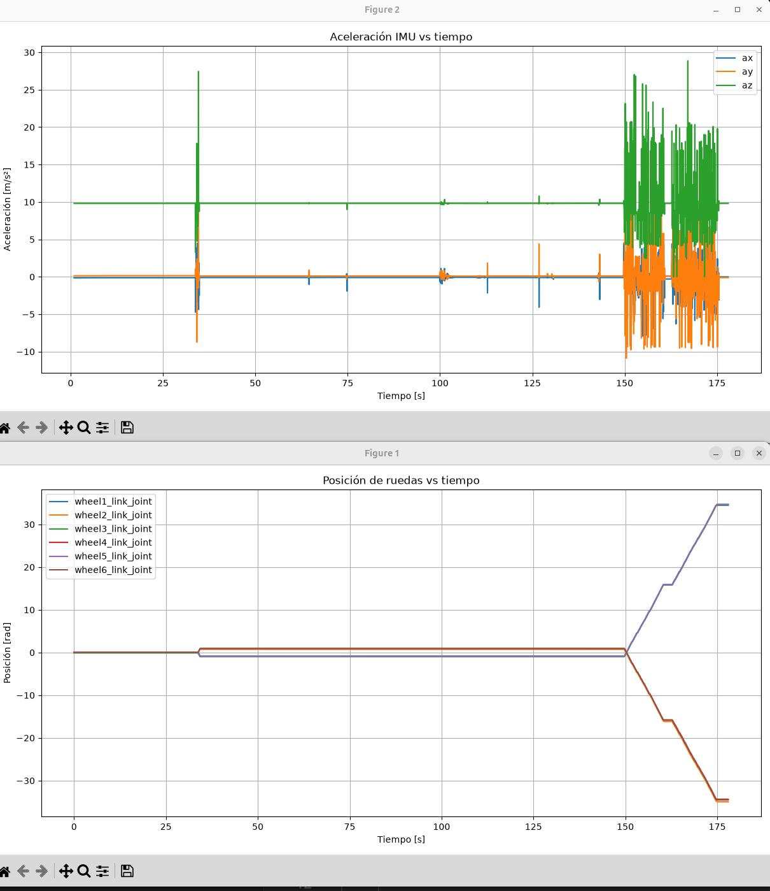
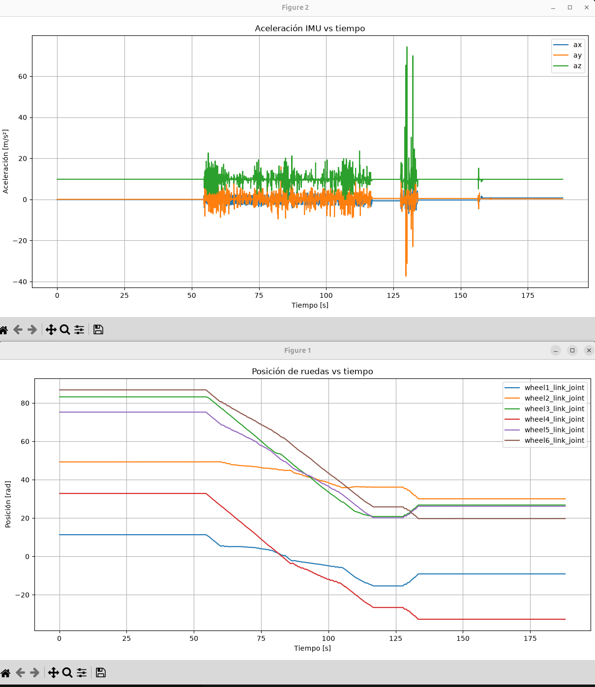

# Rover_modelado-simulacion

Este repositorio contiene archivos para controlar un rover en un entorno simulado. Es parte de la práctica 3 de Modelado y Simulación de robots.

## Contenido

El contenido de este repositorio se divide en 3 carpetas:

1. images: contiene las diversas imagenes pedidas en la práctica.
- **holding_green.png** y **red_blue.png**: entorno simulado.
- **RVIZ_model.png** y **RVIZ_tf.png**: vistas en RViz del modelo y TF del robot con valores aleatorios en las articulaciones.
- **green+10m_graf.png**: gráficas durante la tarea de recoger el cubo verde y avanzar 10 metros.
- **redblue_graf.png**: gráficas durante la tarea de colocar el cubo rojo sobre el azul.

2. ros2_ws: contiene el workspace de ros2 en el cual se ha realizado la práctica, más abajo se explica como utilizarlo.

3. rosbags: contiene los rosbags de las tareas antes mencionada, junto con un script de python para generar las gráficas. Si quieres generar nuevas debes indicarle el nombre del rosbag modificando el script.

## Launchers

Hay dos maneras de lanzar el proyecto.

1. Si solo quieres ver el rover en Rviz y comprobar las tfs y las articulaciones, ejecuta:

```
ros2 launch rover_description launch.py 
```

2. Si quieres generar el rover en el mundo simulado, debes ejecutar estos comandos en 3 terminales diferentes, uno detrás de otro:

```
ros2 launch rover_bringup robot_gazebo.launch.py world_name:=urjc_excavation_msr
```

```
ros2 launch rover_moveit_config move_group.launch.py 
```

```
ros2 launch rover_bringup robot_controllers.launch.py 
```

## Análisis gráficas

Por desgracia, algún problema con el controlador no me permitia obetener el effort de las joints del scara, por lo tanto este análisis es solo de las ruedas y excluye la gráfica gasto vs tiempo.



En este gráfico podemos observar como las ruedas se mueven ligeramente al acercarse al cubo verde, y como aceleran hasta su máximo al realizar la tarea de moverse 10 metros.



En este gráfico observamos la ligera aceleración de las ruedas cuando gira el rover desde la posición del cubo rojo hacia la del azul, con un pequeño pico al final cuando se acerca a la posición del cubo azul.